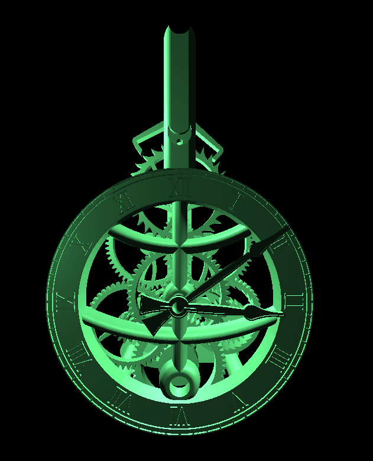

# 3D Mechanical Clock Simulator

## About

It is a 3D mechanical clockwork, animated with raylib:



## Usage

| Key   | Description                                 |
|-------|---------------------------------------------|
| S     | Set the clock to current time               |
| T     | Turbo mode / Realtime mode                  |
| R     | Random color                                |
| B     | Remove/Add front frame                      |
| U     | Enable/Disable Ticking sound                |
| click | Move camera / lock camera                   |


# Installation

Look at the releases

## Building

Use the `build.bat`/`build.sh` file:
```
set CC=clang
./build
```

#### Build Configuration
You can change the compiler and the build configuration by setting an environment variable. Make sure to remove the build directory of a previous run for a clean rebuild.
```
rmdir /s /q build
set CC=cl
set USERFLAGS=-DBAKE -O2
build
```

`-DBAKE` allows baking the assets into the executable.

Similarly on Linux:

```
rm -r build/
export CC=gcc
export USEFLAGS="-D_GLFW_X11 -DBAKE -O2"
./build.sh
```
#### Building for web

Run `build_em.bat`. 

#### Building the asssets from STL sources (optional)

You can look in the tools folder and compile the C files there and run the respective python scripts. Some modifications may be required if you want to convert the assets yourself.

In general the build system needs some work, it should be more cross-platform, but I do not want to require the installation of external tools like make or cmake. 


## License and Credits

This software is licensed under the [GNU GPLv3](https://www.gnu.org/licenses/gpl-3.0.en.html)

Clock desgined by StevePeterson is licensed under the [Creative Commons - Attribution license](https://creativecommons.org/licenses/by/4.0/).
The files can be downloaded under [thingiverse.com](https://www.thingiverse.com/thing:3524448)

Clock ticking sound by Bart Kelsey is licensed under the [Creative Commons - CC0 license](https://creativecommons.org/public-domain/cc0/)
and is available on [opengameart.org](
https://opengameart.org/content/ticking-clock#:~:text=I%20used%20this%20as%20the%20Clockwork%20Sphere%20sound%20effect%20in)

Clock icon is licensed under the [Creative Commons - CC0 license](https://creativecommons.org/public-domain/cc0/)
and is available on [iconduck.com](https://iconduck.com/icons/196859/clock)

And [raylib](https://www.raylib.com/) which is licensed under [zlib/png License](https://github.com/raysan5/raylib/blob/3fb1ba25aca0a6b023ca254a0910df36b0744e64/LICENSE)
